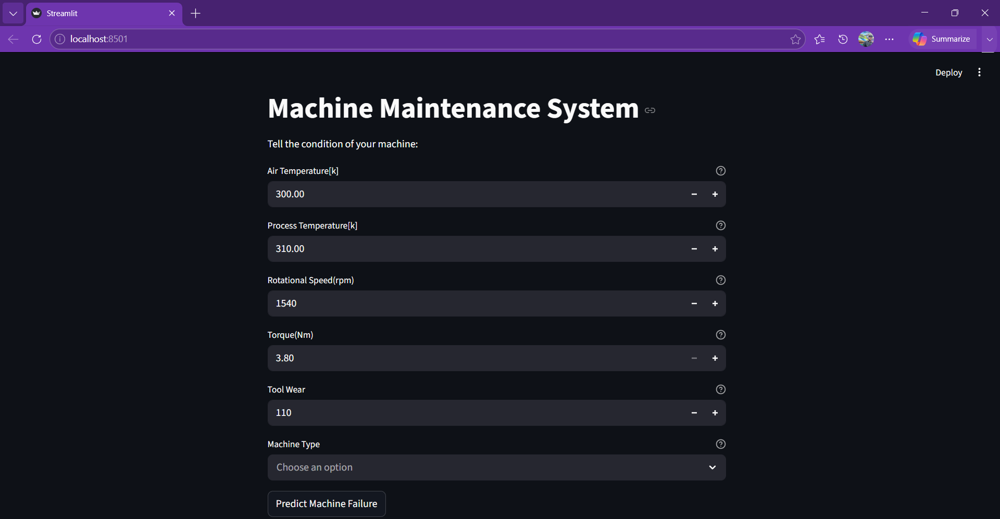
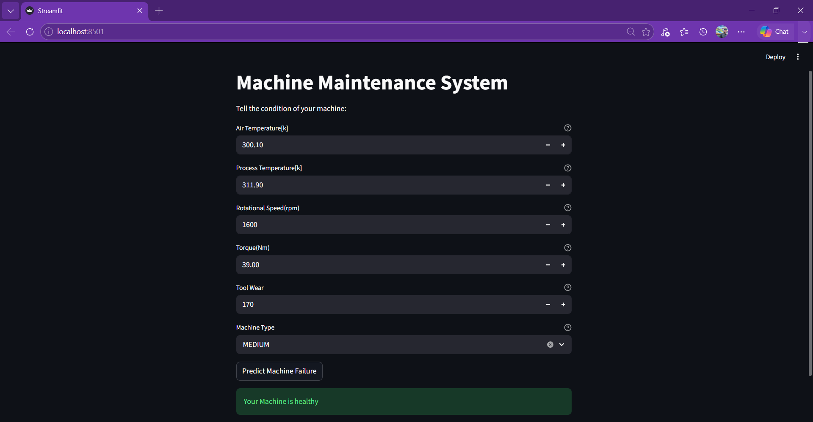
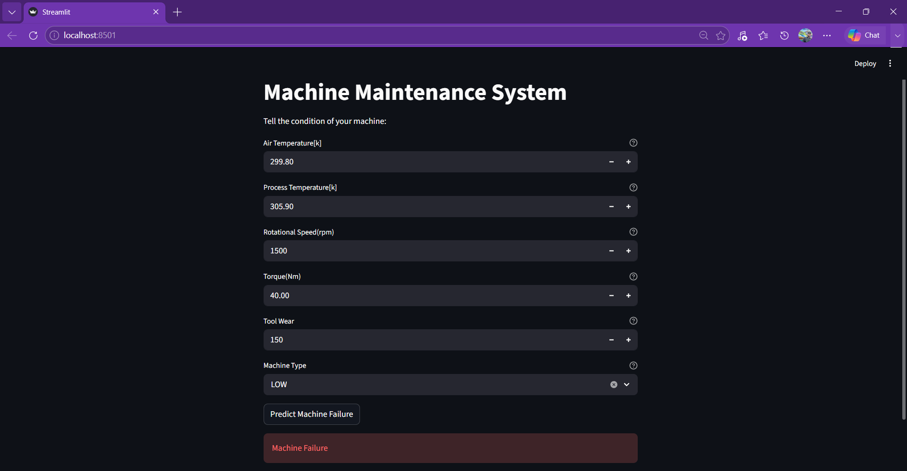

# Machine Maintenance System

This project predicts whether an industrial machine is likely to fail based on its operating conditions using a Machine Learning model.
The application is deployed using Streamlit, allowing users to enter machine parameters and receive real-time predictions.

# File Description
- app.py Contains the streamlit frontend application as well as user interaction logic.
- ai4i2020.csv Dataset containing machine details.
- maintenance.pkl Logistic Regression model saved using Joblib.
- maintenance.ipynb Python Notebook containing data preprocessing, EDA, feature engineering, model training, and evaluation.
- requirements.txt Lists all Python dependencies required to run the project.

# Technologies Used
- Python
- Pandas
- Numpy
- Seaborn
- Scikit-learn
- joblib
- streamlit

# Features
- Data preprocessing and cleaning
- Exploratory Data Analysis (EDA)
- One-Hot Encoding for categorical features
- Logistic Regression model
- Interactive Streamlit web application
- Real-time machine failure prediction

# How to run this project
1. Install required libraries:
```bash
pip install -r requirements.txt
```
2. Launch the Streamlit Application
```bash
streamlit run app.py
```

# Application screenshots
### Home Page


### Machine Healthy


### Machine Failure

